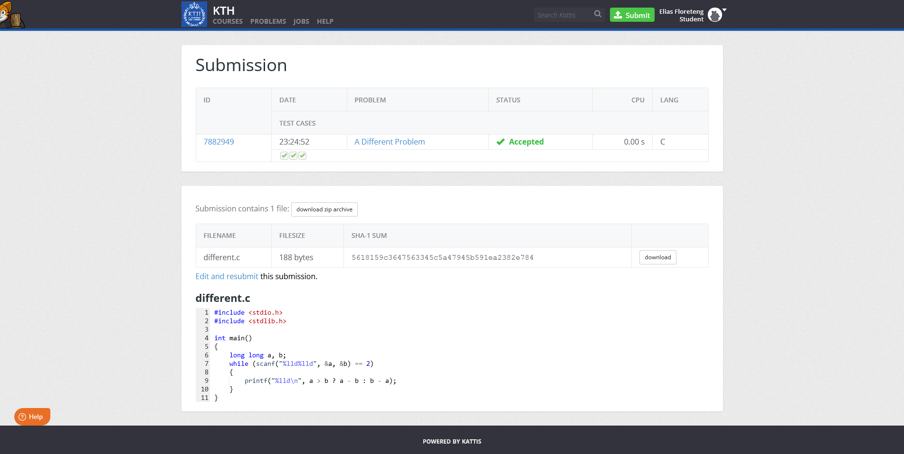
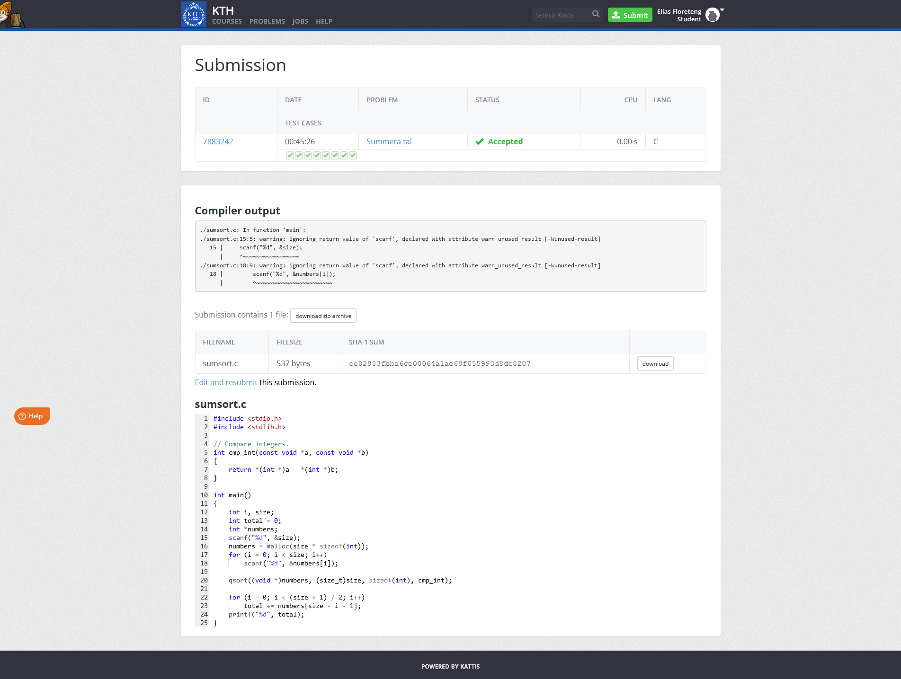

# eliasfl-task-7

C Task 7

## [A Different Problem](https://kth.kattis.com/problems/different)

Source: [`different/different.c`](different/different.c)

## [Summera tal](https://kth.kattis.com/problems/kth.javap.sumsort)

Source: [`sumsort/sumsort.c`](sumsort/sumsort.c)

<!--
Test cases pip till stdin:
Start-Process -FilePath ".\sumsort\sumsort.exe" -RedirectStandardInput ardInput ".\sumsort\sumsort.02.in" -NoNewWindow -Wait
-->
